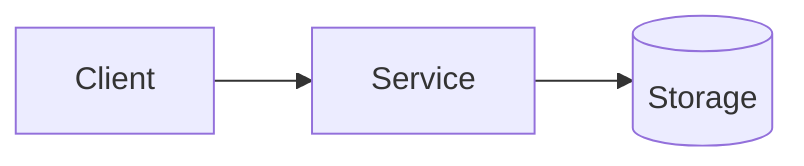
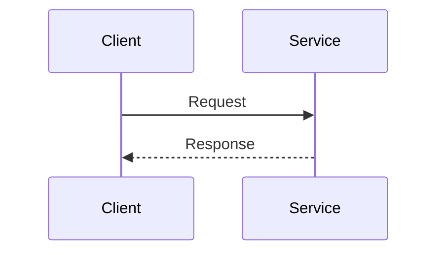

# Tech Spec Template

> Copy this file to `docs/tech-spec/NNN-short-title.md` and fill it in.
> Use a 3-digit prefix (e.g., `001-...`, `042-...`).

---

# Tech Spec: <NNN> - <Short title>

- **Status:** Draft | Accepted | Implementing | Done | Deprecated
- **Last updated:** <YYYY-MM-DD>

## Context

What problem are we solving? Why now? What’s the current state?
Include relevant background and constraints (org/product/infra/compliance).

## Goals

- <goal 1>
- <goal 2>

## Non-goals

- <non-goal 1>
- <non-goal 2>

## Requirements

### Functional

- <req 1>
- <req 2>

### Non-functional

- Performance: <latency/throughput targets, limits>
- Reliability: <SLO/SLA expectations, failure modes>
- Security/Privacy: <authn/z, data handling, threat assumptions>
- Compatibility: <API/CLI backward-compat expectations>

## Proposed design

### High-level approach

Describe the solution at a system level (components, boundaries, responsibilities).

### API / CLI / UX (as applicable)

- Public API (HTTP/gRPC): endpoints, request/response shapes, error model
- CLI: commands/flags, exit codes, stdout/stderr conventions
- Config: env vars, config files, defaults
- Versioning/backward compatibility rules

### Data model (as applicable)

- Types, schemas, persistence, migrations
- Validation rules and invariants

### Error handling

- Error taxonomy (sentinel errors vs wrapped errors)
- User-facing errors vs internal errors
- Retryability and idempotency (if relevant)

### Concurrency and performance (Go-specific)

- Goroutine ownership / lifecycle
- Cancellation (context propagation)
- Timeouts, backpressure, rate limiting
- Hot paths and allocations (if relevant)

### Observability (recommended)

- Logs: key fields, log levels
- Metrics: counters/gauges/histograms to add
- Tracing: span boundaries, key attributes

### Security considerations (recommended)

- Authn/Authz
- Input validation and injection risks
- Secrets management
- Dependencies: any new deps? supply-chain considerations?

## Diagrams

Prefer Mermaid diagrams in Markdown.

### Component diagram

### Sequence diagram

## Alternatives considered

- **Option A:** 
 — Pros/Cons
- **Option B:** 
 — Pros/Cons

Explain why the chosen approach best fits our constraints.

## Testing strategy

### Outside-in tests

- <integration/e2e tests validating user-visible behavior>

### Package/unit tests

- <key packages and what they validate>

### Edge cases

- <notable edge cases and how they’re tested>

### Test data and determinism

- Time, randomness, external services (fakes vs interfaces)
- Golden files and snapshot stability (if used)

## Rollout / migration plan (if applicable)

- Feature flags / staged rollout
- Backward compatibility plan
- Data migrations (forward/backward strategy)
- Monitoring during rollout + rollback criteria

## Risks and mitigations

- <risk>: <mitigation>
- <risk>: <mitigation>

## Decision log

Capture meaningful decisions as they occur.

- **<YYYY-MM-DD>** — <decision> (because <reason>)
- **<YYYY-MM-DD>** — <decision> (because <reason>)

## Open questions

- <question>
- <question>

## Appendix (optional)

[ ] Links, references, rationale, benchmarks, etc.
